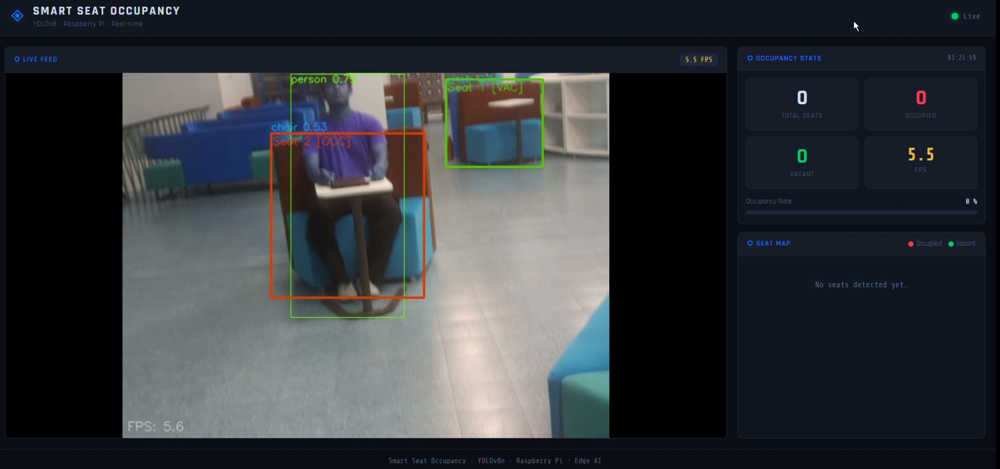
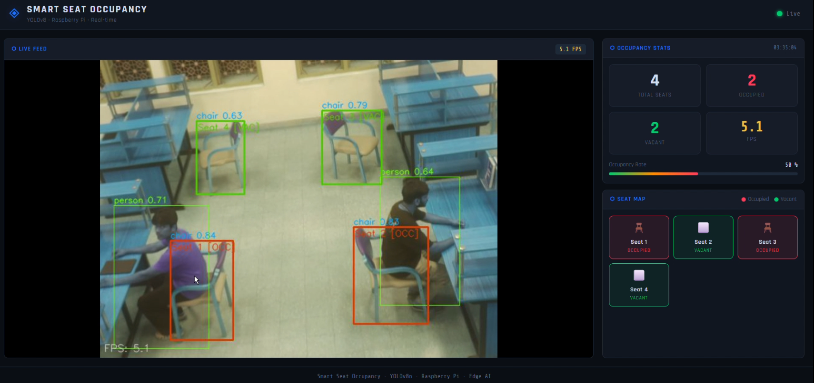
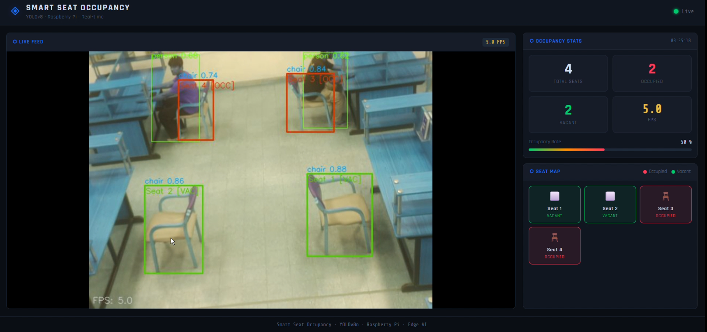
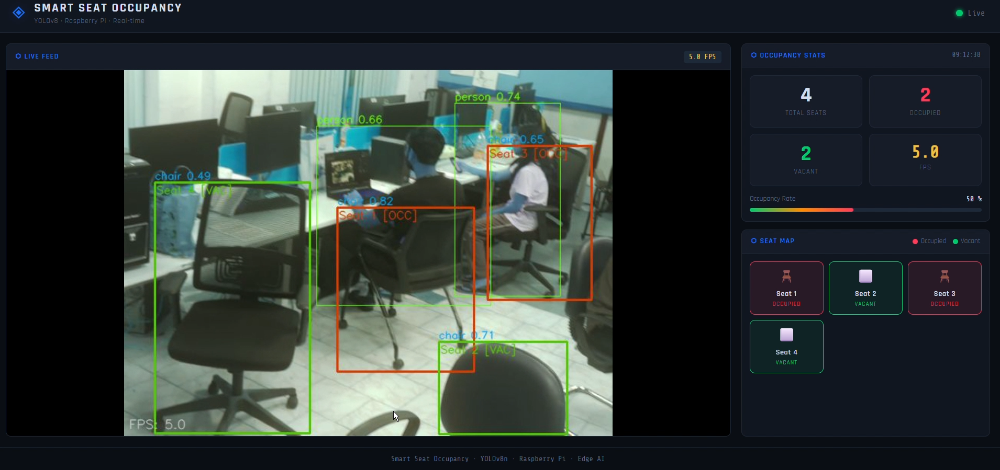
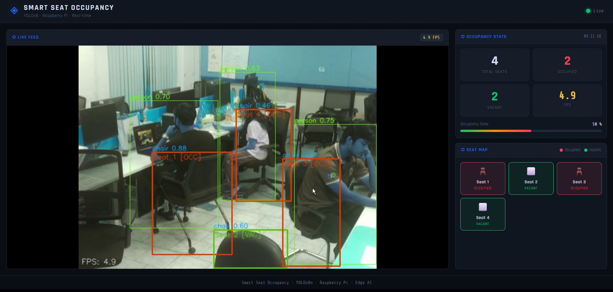

# 🪑 SmartSeat — Real-Time Seat Occupancy Detection using YOLOv8 on Raspberry Pi 5

> **Edge AI Course Project | IISc Bangalore | 2025**

[](https://python.org)
[](https://ultralytics.com)
[](https://tensorflow.org/lite)
[-red.svg)](https://raspberrypi.com)
[](LICENSE)

---

## 📌 Overview

**SmartSeat** is a real-time seat occupancy detection system for libraries and classrooms, built using **YOLOv8n** (`yolov8n.pt`) deployed on a **Raspberry Pi 5 (16GB)** via **TensorFlow Lite**. It detects `person` and `chair` objects from a live Pi Camera feed and uses IoU-based spatial logic to classify each seat as **occupied** (🔴) or **vacant** (🟢), displaying results on a local web dashboard.

Validated across **three real-world environments** — open lounge seating, classroom rows, and computer lab workstations — using COCO pretrained weights, with no custom fine-tuning required.

> 📂 **GitHub Repo:** [https://github.com/kunalkongari/SmartSeat-EdgeAI.git](https://github.com/kunalkongari/SmartSeat-EdgeAI.git)
>
> > 🎥 **Demo Video:** [Demo Videos/ Images](https://drive.google.com/drive/folders/1l1RNwKUP6G8YZzS7CNWWCG-WeI-Pj02M?usp=drive_link)
---

## 🎯 Key Features

- ✅ **14–15 FPS** with INT8 quantization on Raspberry Pi 5 (vs 5–6 FPS baseline)
- ✅ **44% reduction in CPU usage**: from 61% (normal) to 34% (INT8)
- ✅ **4× model size reduction**: ~14MB → ~3.5MB via INT8 quantization
- ✅ Fully **on-device edge inference** — no cloud dependency
- ✅ Live **web dashboard** with per-seat map, occupancy stats, and annotated feed
- ✅ Tested across **3 environments**: open lounge, classroom, computer lab
- ✅ No custom dataset required — uses COCO pretrained `yolov8n.pt`

---

## 📸 Demo Screenshots

### Open Lounge / Library Environment

*Person + chair detected. Seat 1 OCC (red), Seat 1 VAC (green). 5.5 FPS.*

### Library Desk Environment

*4 seats tracked. 2 occupied, 2 vacant. Occupancy rate: 50%.*


*4 seats tracked. 2 occupied, 2 vacant. Occupancy rate: 50%.*

### Computer Lab Environment

*Dense workstation setup. 4 seats, 2 occupied. Overlapping persons/chairs handled.*


*Dense workstation setup. 4 seats, 3 occupied. Overlapping persons/chairs handled but due to latency it took some time to update.*

---

## 📊 Benchmark Results (Raspberry Pi 5)

| Mode | FPS | CPU Before | CPU During | Model Size | Notes |
|------|-----|-----------|-----------|-----------|-------|
| Normal (baseline) | 5–6 | 4% | **61%** | 6.7MB | Too CPU-heavy |
| Float32 TFLite | 7–8 | 3% | 36% | 12.5 MB | Good accuracy |
| FP16 TFLite | 5–6 | 3% | 35% | 6.3 MB | No speed gain on RPi 5 |
| **INT8 TFLite** | **14–15** | **3%** | **34%** | **~3.2 MB** | **Best** |

> **Key insight:** FP16 provides **no performance benefit** on Raspberry Pi 5 — the ARM CPU lacks dedicated FP16 hardware acceleration. INT8 is the clear winner with ~3× FPS improvement and ~44% lower CPU usage vs baseline.

---

## 👥 Team

| Name | Affiliation | SR. No | Email | Contribution |
|------|------------|--------|-------|-------------|
| Kunal Kongari | Smart Manufacturing (DM), IISc | 26732 | kunalkongari@iisc.ac.in | Baseline YOLOv8n inference pipeline |
| Samriddhi Bhattacharjee | Smart Manufacturing (DM), IISc | 26355 | samriddhib@iisc.ac.in | Flask web dashboard development |
| Aryan Dahiya | Mobility Engineering (Mech.), IISc | 26579 | aryandahiya@iisc.ac.in | Model quantization (Float32 / FP16 / INT8) & benchmarking |
| Hake Shivam Panjab | Mobility Engineering (Mech.), IISc | 27141 | shivamhake@iisc.ac.in | IoU-based seat identification logic |

---

## 🏗️ System Architecture

```
┌─────────────────────────────────────────────────────────────┐
│                     SmartSeat Pipeline                      │
├─────────────────────────────────────────────────────────────┤
│                                                             │
│   Pi Camera Module (640×480)                                │
│          │                                                  │
│          ▼                                                  │
│   OpenCV Frame Capture                                      │
│          │                                                  │
│          ▼                                                  │
│   yolov8n.pt → TFLite (INT8 / FP16 / Float32)               │
│          │                                                  │
│          ▼                                                  │
│   Detected Bboxes: [persons] + [chairs]                     │
│          │                                                  │
│          ▼                                                  │
│   IoU Overlap Logic → Occupied / Vacant per seat            │
│          │                                                  │
│          ▼                                                  │
│   Flask Dashboard → Live Feed + Seat Map + Stats            │
│                                                             │
└─────────────────────────────────────────────────────────────┘
```

---

## 🛠️ Hardware & Software

### Hardware
| Component | Specification |
|-----------|-------------|
| Edge Device | **Raspberry Pi 5 (16GB RAM)** |
| Camera | Raspberry Pi Camera Module v2 |


### Software
| Tool | Purpose |
|------|---------|
| Python 3.11 | Core language |
| Ultralytics YOLOv8 (`yolov8n.pt`) | Pretrained COCO object detection |
| TensorFlow Lite | Model conversion & INT8/FP16/Float32 inference |
| OpenCV | Camera capture & image processing |
| Flask | Web dashboard backend |
| Raspberry Pi OS 64-bit | Operating system |

---

## 📁 Project Structure

```
SmartSeat-EdgeAI/
│
├── model/
│   ├── yolov8n.pt                  # Standard model
│   ├── yolov8n_float32.tflite      # Float32 TFLite (7–8 FPS, 36% CPU)
│   ├── yolov8n_fp16.tflite         # FP16 TFLite (5–6 FPS, 35% CPU)
│   └── yolov8n_int8.tflite         # INT8 TFLite (14–15 FPS, 34% CPU) ← recommended
│
├── inference.py                # Main inference pipeline
├── utils.py                    # Decision logic 
│
├── templates/
│   └── index.html                  # Dashboard UI
│
├── static/
│   └── style.css                   # Dashboard styling
│   └── script.js                   # Dashboard Frontend
│
├── images/                         # Demo screenshots (7 real demo frames)
├── setup.sh   
│
├── requirements.txt
├── README.md
├── report.md
└── submission.txt
```

---

## ⚙️ Setup & Installation

### Step 1: Clone the Repository
```bash
git clone https://github.com/kunalkongari/SmartSeat-EdgeAI.git
cd SmartSeat-EdgeAI
```

### Step 2: Install Dependencies
```bash
sudo apt update && sudo apt upgrade -y
sudo apt install python3-pip python3-opencv libatlas-base-dev -y
pip3 install -r requirements.txt
```

**requirements.txt:**
```
ultralytics
tflite-runtime
opencv-python
flask
picamera2
numpy
```

### Step 3: Enable Pi Camera
```bash
sudo raspi-config
# → Interface Options → Camera → Enable
sudo reboot
```

### Step 4: Export YOLOv8n to TFLite (pre-exported models included)
```python
# scripts/export_tflite.py
from ultralytics import YOLO
model = YOLO("yolov8n.pt")
model.export(format="tflite")             # Float32
model.export(format="tflite", half=True)  # FP16
model.export(format="tflite", int8=True)  # INT8
```

### Step 5: Run model
```bash
# Recommended: INT8 — 14–15 FPS, only 34% CPU
python3 app.py --model models/yolov8n_int8.tflite

# Float32 — 7–8 FPS, 36% CPU
python3 src/inference.py --model models/yolov8n_float32.tflite
```

### Step 6: Launch Web Dashboard
```bash
python3 src/dashboard.py
# Open browser: http://<raspberry-pi-ip>:5000
```

---

## 🔬 Seat Identification Logic

```python
def is_seat_occupied(person_bbox, chair_bbox, iou_threshold=0.15):
    """
    Returns True if person bbox overlaps chair bbox above IoU threshold.
    🔴 Occupied  →  IoU > threshold
    🟢 Vacant    →  chair detected, no overlapping person
    """
    iou = compute_iou(person_bbox, chair_bbox)
    return iou > iou_threshold
```

---

## 🤖 AI Tools Used

| Tool | Usage |
|------|-------|
| ChatGPT (OpenAI) | Debugging, optimization ideas, documentation support |
| YOLOv8 (Ultralytics) | Pretrained COCO object detection (`yolov8n.pt`) |
| TensorFlow Lite | Model conversion & INT8/FP16/Float32 quantization |
| OpenCV | Camera input & frame processing |

*All AI-assisted portions attributed above per course policy.*

---

## ⚠️ Limitations

- FP16 TFLite provides no speed improvement on RPi 5 (no FP16 hardware acceleration on ARM)
- Chair detection confidence drops to ~0.46 in low-light / dark environments
- Dense workstation bbox overlap can occasionally confuse IoU logic
- Single Pi Camera has limited FOV for large rooms

---

## 📚 References

1. Ultralytics YOLOv8: https://github.com/ultralytics/ultralytics
2. COCO Dataset: https://cocodataset.org
3. TFLite Quantization: https://www.tensorflow.org/lite/performance/post_training_quantization
4. OpenCV: https://docs.opencv.org
5. Raspberry Pi 5: https://www.raspberrypi.com/products/raspberry-pi-5/
6. Edge AI Course 2025: https://www.samy101.com/edge-ai-25/project/

---

## 📄 License

MIT License — see [LICENSE](LICENSE) for details.

---

*Edge AI Course — IISc Bangalore, 2026*
