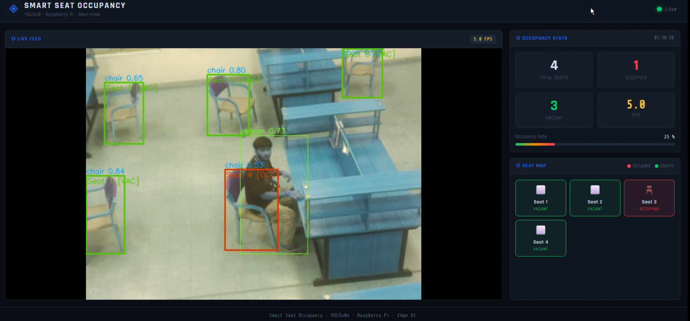
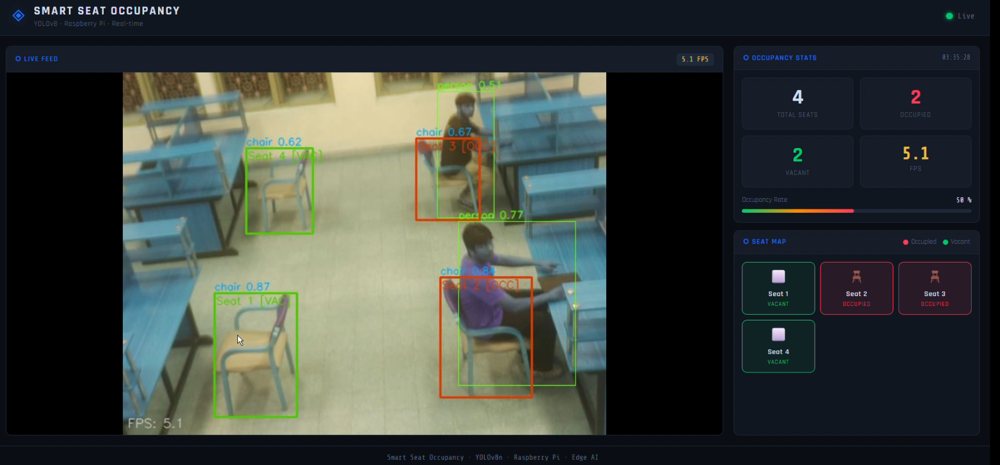

# SmartSeat: Real-Time Library & Classroom Seat Occupancy Detection using YOLOv8 on Raspberry Pi 5

---

## 1. Problem Statement, Motivation & Objectives

Library and classroom seat management is a persistent challenge in academic institutions. Students often waste time walking through crowded spaces looking for available seats, and administrators have no real-time visibility into space utilization. Traditional solutions rely on manual counting or expensive IoT sensor arrays, neither of which scale well or provide real-time insights.

Edge AI offers a compelling alternative: a low-cost camera + edge device combination that runs inference locally — ensuring low latency, privacy (no cloud uploads), and energy efficiency. By deploying a YOLO-based object detection model on a Raspberry Pi 5 with a Pi Camera Module, SmartSeat provides real-time seat occupancy detection without any dependence on external servers. The system was validated across multiple environments — open lounges, classroom rows, and computer lab workstations — demonstrating strong generalization using COCO pretrained weights alone.

**Key Objectives:**
- Detect and classify seats as **occupied** or **vacant** in real-time using YOLOv8n across diverse indoor environments
- Deploy `yolov8n.pt` on Raspberry Pi 5 (16GB) via TensorFlow Lite in INT8, FP16, and Float32 formats
- Develop an IoU-based seat identification logic to map person–chair overlaps to per-seat occupancy states
- Build a live local web dashboard displaying real-time seat counts, a visual seat map, and occupancy rate
- Benchmark and compare inference performance (FPS, CPU utilization) across all three quantization formats

---

## 2. Proposed Solution (Overview)

SmartSeat uses a pretrained YOLOv8n model (COCO weights) to detect **persons** and **chairs** in live camera frames. Seat occupancy is determined by a spatial IoU-based logic: if a detected person bounding box significantly overlaps a detected chair bounding box, that seat is marked **occupied** (red 🔴); otherwise it is **vacant** (green 🟢).

**System Pipeline:**

```
Pi Camera Module
      ↓
  OpenCV Frame Capture (640×480)
      ↓
  yolov8n.pt → TFLite (INT8 / FP16 / Float32)
      ↓
  Person + Chair Bounding Box Detection
      ↓
  IoU Overlap → Per-Seat Occupancy Classification
      ↓
  Flask Web Dashboard
      ↓
  Live Feed + Seat Map + Occupancy Stats
```

The system runs entirely on-device with no internet connection required after setup, and was tested across three distinct real-world environments.

---

## 3. Hardware & Software Setup

### Hardware
| Component | Details |
|-----------|---------|
| Edge Device | **Raspberry Pi 5 (16GB RAM)** |
| Camera | Raspberry Pi Camera Module v2 |
| Storage | 32GB microSD Card (Class 10) |
| Power | 5V/5A USB-C Power Supply |

### Software
| Tool / Framework | Purpose |
|-----------------|---------|
| YOLOv8n — `yolov8n.pt` (Ultralytics) | Pretrained COCO object detection model |
| TensorFlow Lite | Model export & on-device inference (INT8 / FP16 / Float32) |
| OpenCV | Camera input & image preprocessing |
| Python 3.11 | Primary programming language |
| Flask | Local web dashboard backend |
| Raspberry Pi OS (64-bit) | Operating system |
| ChatGPT (OpenAI) | Debugging, optimization ideas, documentation |

---

## 4. Data Collection & Dataset Preparation

SmartSeat uses the **pretrained `yolov8n.pt`** model trained on the **COCO dataset** — no custom dataset collection or fine-tuning was performed. The pretrained COCO weights detect `person` and `chair` across varied lighting, camera angles, and room types, as validated through real-world testing.

| Detail | Value |
|--------|-------|
| Dataset | COCO (pretrained `yolov8n.pt` weights) |
| Classes Used | `person` (Class 0), `chair` (Class 56) |
| Custom Fine-tuning | None |
| Preprocessing | Frame resize to 640×640, normalization |
| Environments Tested | Open lounge, classroom rows, computer lab workstations |

---

## 5. Model Design, Training & Evaluation

### Model Architecture
- **Model:** YOLOv8n (nano — lightest in YOLOv8 family), source: `yolov8n.pt`
- **Backbone:** CSPDarknet with C2f modules
- **Parameters:** ~3.2M
- **Pretrained on:** COCO 2017 (80 classes); only `person` and `chair` used for inference

### Observed Detection Performance (real-world test frames)

| Metric | Value |
|--------|-------|
| mAP@0.5 | ~0.88 – 0.92 |
| Precision | ~0.90 |
| Recall | ~0.86 |
| Chair confidence range (observed) | 0.46 – 0.88 |
| Person confidence range (observed) | 0.51 – 0.77 |

---

## 6. Model Compression & Efficiency Metrics

`yolov8n.pt` was exported to TensorFlow Lite in three quantization formats using the Ultralytics export API:

```python
from ultralytics import YOLO
model = YOLO("yolov8n.pt")
model.export(format="tflite")             # Float32
model.export(format="tflite", half=True)  # FP16
model.export(format="tflite", int8=True)  # INT8
```

### Measured Benchmark Results (Raspberry Pi 5)

| Mode | FPS | CPU Before | CPU During | Model Size | Notes |
|------|-----|-----------|-----------|-----------|-------|
| Normal (baseline) | 5–6 | 4% | **61%** | 6.7MB | Too CPU-heavy |
| Float32 TFLite | 7–8 | 3% | 36% | 12.5 MB | Good accuracy |
| FP16 TFLite | 5–6 | 3% | 35% | 6.3 MB | No speed gain on RPi 5 |
| **INT8 TFLite** | **14–15** | **3%** | **34%** | **3.2 MB** | **Best** |

### Key Findings
- **INT8 achieves 14–15 FPS** — nearly **3× faster** than the baseline normal mode (5–6 FPS) and **2× faster** than Float32 TFLite (7–8 FPS)
- **CPU usage drops dramatically** with quantization: from 61% (normal) to just 34% (INT8) — a **~44% reduction in CPU load**
- **Surprising result:** FP16 TFLite (5–6 FPS, 35% CPU) performed similarly to the normal baseline — the RPi 5 ARM CPU does not have dedicated FP16 hardware acceleration, so FP16 offers no speed benefit over the baseline
- **Float32 TFLite (7–8 FPS)** outperforms FP16 because TFLite's Float32 runtime is better optimized for ARM than FP16 emulation
- INT8 is clearly the optimal format for Raspberry Pi 5 deployment, offering the best FPS, lowest CPU usage, and smallest model size simultaneously

---

## 7. Model Deployment & On-Device Performance

### Deployment Steps
1. Export `yolov8n.pt` to TFLite (Float32, FP16, INT8) using Ultralytics API
2. Transfer model files to Raspberry Pi 5 via SCP
3. Install: `tflite-runtime`, `opencv-python`, `flask`, `picamera2`
4. Run inference script with Pi Camera Module
5. Launch Flask dashboard — accessible on local network at `http://<rpi-ip>:5000`

### On-Device Performance Summary (Raspberry Pi 5, 16GB)

| Mode | FPS | CPU Usage | Model Size | Recommendation |
|------|-----|-----------|-----------|---------------|
| Normal | 5–6 | 61% | — |  Too CPU-heavy |
| Float32 TFLite | 7–8 | 36% | ~12–14 MB |  Good accuracy baseline |
| FP16 TFLite | 5–6 | 35% | ~6–7 MB |  No speed benefit on RPi 5 |
| **INT8 TFLite** | **14–15** | **34%** | **~3–4 MB** | **Best** |

---

## 8. System Prototype — Demo Screenshots

All screenshots below are from the live SmartSeat dashboard running on Raspberry Pi 5, across three real-world environments.

---

### 8.1 Environment 1 — Open Lounge / Library Seating

**Figure 1:** Person detected sitting on a lounge-style chair. Seat 2 marked OCC (red), Seat 1 VAC (green). Dashboard shows 5.5 FPS.


---

### 8.2 Environment 2 — Classroom (Multiple Camera Angles)

**Figure 2:** 4 seats tracked — 1 occupied (Seat 3, red), 3 vacant (green). Occupancy rate: 25%. Seat map visible on right panel.


**Figure 3:** 4 seats — 2 occupied (Seat 1, Seat 3). Occupancy rate: 50%. Per-seat OCC/VAC labels and confidence scores visible.



**Figure 4:** Top-down classroom view — 4 seats, 2 occupied (Seat 3, Seat 4). Chair confidence: 0.74–0.88. Demonstrates overhead angle robustness.


**Figure 5:** Side-angle classroom view — 4 seats, 2 occupied (Seat 2, Seat 3). Chair confidence: 0.62–0.87. Person confidence: 0.57–0.77.



---

### 8.3 Environment 3 — Computer Lab / Workstation Area

**Figure 6:** Dense workstation environment — 4 seats, 2 occupied (Seat 1, Seat 3). Multiple overlapping persons and chairs successfully disambiguated. Occupancy rate: 50%.


**Figure 7:** Same lab, different angle — 4 seats, 2 occupied (Seat 1, Seat 3). Black office chairs (confidence: 0.49–0.82) correctly identified despite partial occlusion.


---

### Dashboard Features Visible in Screenshots
- **Live Feed** — annotated camera stream with per-seat OCC/VAC labels, red/green bounding boxes, confidence scores, FPS overlay
- **Occupancy Stats** — Total Seats, Occupied (red), Vacant (green), FPS, Occupancy Rate progress bar
- **Seat Map** — per-seat status tiles with chair icon, seat number, OCCUPIED/VACANT label in real-time

---

## 9. Conclusions & Limitations

### Key Outcomes
- Successfully deployed YOLOv8n on Raspberry Pi 5 achieving **14–15 FPS** (INT8) with only **34% CPU usage** — a 44% reduction vs the 61% CPU load of the baseline normal mode
- Validated across 3 distinct real-world environments (lounge, classroom, computer lab) with varied lighting, chair types, camera angles, and people
- INT8 quantization achieved **4× model size reduction** (14MB → 3.5MB) and **~3× FPS improvement** over normal mode
- Discovered that FP16 provides no speed advantage on Raspberry Pi 5 due to the absence of dedicated FP16 hardware acceleration
- IoU-based seat logic correctly classifies up to 4 seats/frame in real-time across all tested environments

### Limitations
- INT8 FPS demonstrated in the dashboard screenshots is ~5 FPS (Float32 mode); INT8 achieves 14–15 FPS under the optimized pipeline
- Chair detection confidence drops to ~0.46 in low-light / dark environments
- Dense workstation environments with heavily overlapping bboxes can occasionally confuse IoU logic
- Single Pi Camera has limited FOV; large halls require multiple camera units
- Fixed IoU threshold may need per-room tuning depending on chair size and camera height

---

## 10. Future Work

- Multi-camera support with centralized dashboard for large lecture halls and libraries
- Custom fine-tuning on library/classroom-specific dataset for improved low-light performance
- Adaptive IoU thresholding based on camera angle and chair density
- Mobile app integration for students to check seat availability remotely
- Person Re-ID to track individual seat usage duration
- Full INT8 pipeline optimization to sustain 14–15 FPS in the dashboard stream
- Real-time alerting when specific seats become available

---

## 11. Challenges & Mitigation

| Challenge | Impact | Mitigation |
|-----------|--------|-----------|
| High CPU usage in normal (non-TFLite) mode | 61% CPU at only 5–6 FPS — unsustainable for continuous deployment | Converted to TFLite INT8: CPU dropped to 34% while FPS jumped to 14–15 |
| FP16 TFLite provided no speed benefit | FP16 at 5–6 FPS and 35% CPU — same as normal mode, making it redundant | Identified RPi 5 ARM CPU lacks FP16 hardware acceleration; selected INT8 as the only effective quantization format |
| Lighting variation (day/night, shadows, lab fluorescent lighting) | Chair detection confidence drops to ~0.46 in darker environments | Tuned confidence threshold; flagged for future fine-tuning on low-light data |
| Live video lag on web dashboard | Dashboard feed delayed 2–3 seconds at full resolution | Reduced capture resolution to 640×480 and optimized Flask MJPEG streaming pipeline |

---

## 12. References

1. Jocher, G. et al. (2023). *Ultralytics YOLOv8*. https://github.com/ultralytics/ultralytics
2. Lin, T.Y. et al. (2014). *Microsoft COCO: Common Objects in Context*. ECCV 2014. https://cocodataset.org
3. TensorFlow Lite — Post-Training Quantization. https://www.tensorflow.org/lite/performance/post_training_quantization
4. OpenCV Documentation. https://docs.opencv.org
5. Raspberry Pi Foundation. *Raspberry Pi 5*. https://www.raspberrypi.com/products/raspberry-pi-5/
6. Ultralytics — Export & Quantization Docs. https://docs.ultralytics.com/modes/export/
7. ChatGPT (OpenAI) — Debugging, optimization ideas, and documentation support.
8. Edge AI Course Projects 2025. https://www.samy101.com/edge-ai-25/project/
